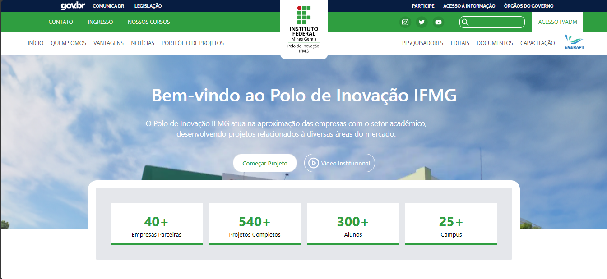
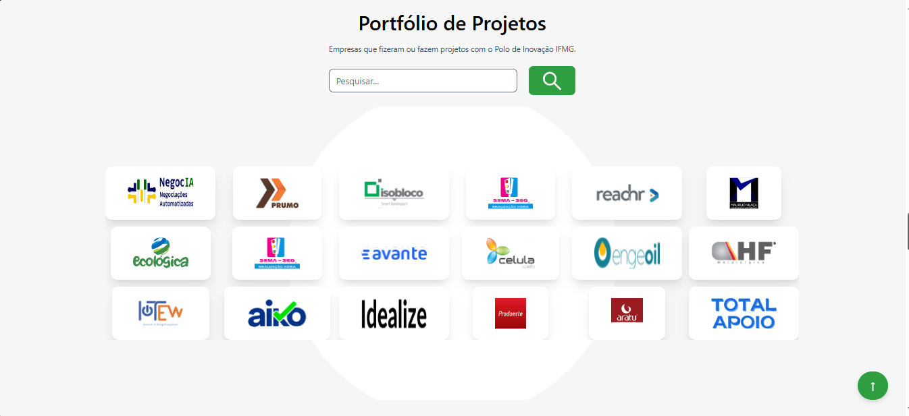
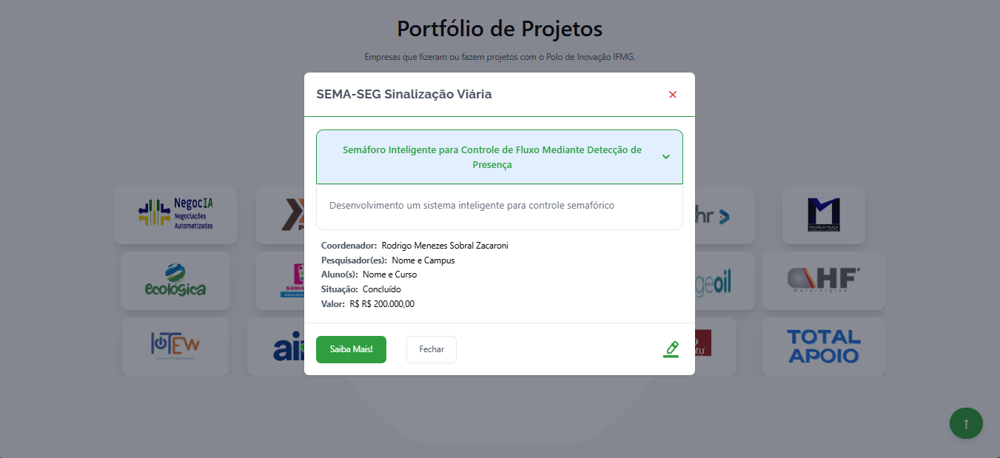
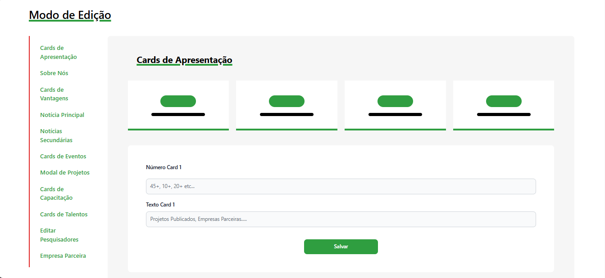

# Novo Site do Polo de Inovação do IFMG

[](https://github.com/athityakumar/colorls/actions/workflows/ruby.yml)


Aplicativo desenvolvido em Vue como meu Trabalho de Conclusão de Curso para curso de Ciência da Computação pelo Instituto Federal de Minas Gerais, minha proposta foi de criarmos um site onde os textos dos componentes assim como as imagens sejam plenamente editáveis, neste projeto foram aplicados `Javascript`, `TailwindCSS`, `Vue.js`, também usei bastante uma biblioteca de componentes chamada `FlowbiteUI`, que consome `TailwindCSS` pra construções dos componentes, a aplicação também é `responsiva` com uma série de requisições assíncronas via `Axios` construída em cima de `componentes acessíveis`, `manipulação de DOM` e consumo de `REST API Java Spring`.

*Caso tenha interesse em verificar a API deste APP feita em Spring, acesse [esse link](https://github.com/pedromends/api-polo).*

# Executando...

 Abaixo veja algumas imagens do site.

### Home Page



### Sobre nós/Quem somos


### Listagem de Projetos



### Modal aberto



### Módulo de Edição




# Instalação

1. Com o Node.js e o Vue.js instalado na sua máquina, rode os comandos
2. Faça o [Download](https://www.nerdfonts.com/font-downloads) do projeto contigo neste repositório e o abra no editor de texto de sua preferência.

    ```sh
    npm install
    npm run serve
    ```

# Autores

João Pedro Souza
